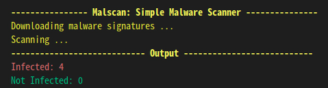

# malscan
[](https://www.python.org/)

very very simple malware scanner written in Python3.



## Installation
```
$ git clone https://github.com/tomoyasuzuki/malscan.git
```
## How To Use
```
$ cd malscan
$ python main.py --path <target path>
```

## Reference
- [password123456/malwarescanner](https://github.com/password123456/malwarescanner)

